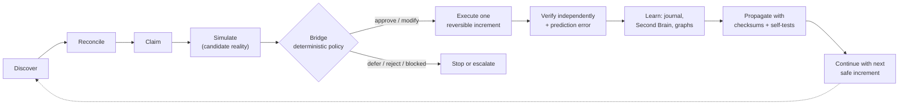

# DRGB Ecosystem Core (`drgb-core`)

**The operating skill that makes every AI agent in the ecosystem earn its authority from evidence instead of assuming it.**

| | |
|---|---|
| **Skill identity** | `drgb-core` (human shorthand: *DRGB*) |
| **Contract** | `drgb-core.v2.0` |
| **Architecture** | Dual Reality Guardian Bridge, invented by Derek Keene |
| **Generalized core** | SGAM governor (`sgam.governor.governor.Governor`) |
| **Runtimes** | Claude Code, Codex, Hermes, and any agent that loads `SKILL.md` skills |
| **Dependencies** | Python 3 standard library only (POSIX; syntax-compatible with 3.8+) |
| **Status** | In production across 3 hosts and 12 verified installs (see [Deployment](#deployment)) |

> **CONFIDENTIAL. Proprietary and pre-filing.** This repository describes an invention of Derek Keene that is held
> under a trade-secret posture pending a provisional patent application. Keep this repository **private**. Do not
> publish, fork publicly, open-source, demo externally, or share outside authorized collaborators until counsel
> advises otherwise. See [LICENSE](LICENSE).

---

## What it is

DRGB is an operating invariant for autonomous agents. For every meaningful transition, an agent following this skill:

1. builds a **candidate reality**: what it expects to happen (dry run, simulation, replay, test, preview or explicit prediction with a falsifier);
2. compares it with **live reality** from an authoritative source;
3. lets **deterministic policy**, never a model, issue a bounded grant of authority;
4. executes one reversible increment, **verifies it independently**, and measures the prediction error;
5. feeds the verified outcome back into shared memory, knowledge graphs and the coordination journal.

Models may reason, hypothesize and critique. **They may never grant themselves authority.** Missing, stale or conflicting
evidence fails closed.

This package is the portable *skill* form of DRGB: the rules, contracts and tools that agents load at runtime. It is one
of three related bodies of work:

| Repository | Role |
|---|---|
| **`drgb-core-skill`** (this repo) | Agent-facing operating skill: loop, modes, contract, coordination tools |
| [`drgb-core`](https://github.com/contact142/drgb-core) (private) | Reference implementation: observe, twin, guardian ledger, bridge, graph; 381 tests |
| `sgam` (private) | Generalized governor and swarm control plane that DRGB governs |

Prometheus's `GuardianBridge` (market DRGB) is one **domain profile** of this contract, not the ecosystem core
(see [`references/market-profile.md`](references/market-profile.md)).

## What it can do

- **Govern any agent action proportionally.** Light, Standard and Full modes scale the required evidence to the real consequence of the action.
- **Coordinate many agents safely.** An append-only journal of claims, heartbeats, handoffs, blocks and completions prevents two agents from working on the same resource.
- **Maintain a shared Second Brain.** Every journal event atomically refreshes a provenance-labelled context, manifest and deterministic coordination subgraph.
- **Discover the ecosystem read-only.** Inventories agent runtimes and skill copies, memory sources, graph indexes and stale markers, and explicitly selected SSH nodes.
- **Synchronize the fleet with proof.** Propagates the package and merges journals across explicit SSH nodes by event ID, never dropping a node's events, and proves it with checksums and self-tests.
- **Validate evidence envelopes.** Rejects malformed envelopes and model output that tries to smuggle in authority fields.
- **Enforce the authority boundary.** Never infers permission to trade, move funds, send messages, deploy, change billing, expose credentials or broaden agent permissions.

## The operating loop



| Step | What happens |
|---|---|
| Discover | Topology: runtimes, hosts, repos/worktrees, skill copies, memory, graphs, journal claims, authoritative systems |
| Reconcile | Memory, graphs, prompts and handoffs are evidence, never live truth; contradictions are preserved |
| Claim | Smallest non-overlapping scope, published to the shared journal before mutation |
| Simulate | Expected outcome plus a falsifier, via dry run, replay, test, preview or checklist |
| Bridge | Deterministic policy binds evidence, payload, scope, obligations and expiry into a bounded grant |
| Execute | One reversible increment; authoritative state refreshed right before consequential writes |
| Verify | Independent observation of the result; stop or compensate on material divergence |
| Learn | Provenance-labelled handoff; Second Brain refresh; graph intake through its owning planner |
| Propagate | Verified changes synchronized to runtimes; copying alone never counts as synchronization |

## Proportional operating modes

| Mode | Use for | Adds |
|---|---|---|
| **Light** | Read-only work; small reversible, named-scope changes | Exact scope, prediction and falsifier, rollback locator, independent verification, claim and completion |
| **Standard** | Services, deployments, multi-agent or cross-system work | Authoritative preflight, deterministic verdict, scoped rollback, independent verifier, handoff |
| **Full** | Money, trading, custody, credentials, identity, outbound messages, destructive or irreversible work | Fresh authenticated evidence, the owning deterministic executor and its gate, operator approval, post-action reconciliation |

Never downclassify by splitting a consequential action into smaller steps. Details:
[`references/operating-modes.md`](references/operating-modes.md).

## Tools

All tools are standard-library Python, print JSON, and include a `--self-test`.

| Tool | Purpose | Mutates? |
|---|---|---|
| [`scripts/probe_drgb_core.py`](scripts/probe_drgb_core.py) | Validate the installation, emit the prompt context, validate evidence envelopes and model JSON | No |
| [`scripts/ecosystem_probe.py`](scripts/ecosystem_probe.py) | Read-only topology manifest: runtimes, skill copies, memory, graphs, SSH (only hosts you name) | No |
| [`scripts/coordination_journal.py`](scripts/coordination_journal.py) | Append claims and handoffs; show status; merge journals; rebuild the Second Brain and subgraph | Local journal only |
| [`scripts/fleet_sync.py`](scripts/fleet_sync.py) | Inspect explicit SSH nodes; with `--apply`, sync the package and merge journals | Only with `--apply` |

```bash
# Is this runtime installed correctly?
python3 scripts/probe_drgb_core.py --self-test

# Read-only ecosystem map (no SSH unless you pass --ssh-host)
python3 scripts/ecosystem_probe.py --write-manifest /tmp/drgb-topology.json

# Claim work before changing anything, then close it with the SAME task and correlation ID
python3 scripts/coordination_journal.py record --event claim \
  --runtime claude --task my-task-20260924 --correlation-id my-task-20260924 \
  --path /path/to/resource --predicted-outcome "..." --falsifier "..."
python3 scripts/coordination_journal.py record --event complete \
  --runtime claude --task my-task-20260924 --correlation-id my-task-20260924 \
  --verification-result pass --check "what was verified"
python3 scripts/coordination_journal.py status --limit 20

# Fleet: always dry-run first; mutation requires --apply
python3 scripts/fleet_sync.py --host <ssh-alias> --sync-package --sync-journal
python3 scripts/fleet_sync.py --host <ssh-alias> --sync-package --sync-journal --apply
```

State lives in `~/.drgb/` (override with `DRGB_STATE_DIR`): `coordination/events.jsonl` (append-only journal) and
`second-brain/` (context, manifest, `drgb-subgraph.json`).

## Evidence contract

Every consequential step is described by a `drgb-core.v2.0` evidence envelope: worker, scope and scale
(action, agent, team or system), topology, candidate reality, live reality, bridge verdict
(`approve | modify | defer | reject | escalate | data_unavailable | blocked`), execution authority
(`reasoning_only | bounded_write | authenticated_gate`), verification, and learning. Evidence classes run from
`AUTHORITATIVE_LIVE` down to `MODEL_HYPOTHESIS`; anything unverifiable is reported as `DATA_UNAVAILABLE`, never invented.
Full schema: [`references/contract.md`](references/contract.md).

## Deployment

Verified 2026-09-24: every install below matched package digest **`b6e308b7dc3816f5`** and contract `drgb-core.v2.0`.

| Host | Install paths |
|---|---|
| Ubuntu operator host | `~/.claude/skills/drgb-core`, `~/.codex/skills/drgb-core`, `~/.agents/skills/drgb-core`, `operator-brain/skills/drgb-core` |
| MacBook | `~/.claude/skills/drgb-core`, `~/.codex/skills/drgb-core`, `~/.agents/skills/drgb-core`, `~/.hermes/skills/drgb-core` |
| VPS | host `/root/{.claude,.codex,.agents}/skills/drgb-core`; Hermes container `/home/hermes/.hermes/skills/drgb-core` |

The shared journal and Second Brain are populated by Claude, Codex and Hermes agents working as one coordinated team.

### Verify an install

```bash
cd <install-path>
python3 scripts/probe_drgb_core.py --self-test          # expect "ok": true, drgb-core.v2.0
# package digest (repository docs excluded; locale-independent ordering)
find . -type f -not -path '*/__pycache__/*' -not -name README.md -not -name LICENSE -not -name .gitignore \
  -not -path './.git/*' | LC_ALL=C sort | xargs sha256sum | sha256sum | cut -c1-16
```

### Install or update

Copy the package files (everything except `README.md`, `LICENSE`, `.gitignore`) into the runtime's skill directory,
for example `~/.claude/skills/drgb-core/`. Then run the self-test and compare the digest with a known-good install. For
multiple nodes, use `fleet_sync.py` (dry run first). The update is complete only when every runtime reports the same
contract version, digest and a passing self-test.

## Repository layout

```
SKILL.md                         skill entry point: identity, modes, loop, authority boundary
agents/openai.yaml               display metadata for agent UIs
references/contract.md           evidence envelope, prompt envelope, fail-closed and evolution rules
references/coordination-loop.md  shared surfaces, nested swarm cells, collision rules, handoff minimum
references/ecosystem-topology.md discovery order, evidence classes, SSH/memory/graph rules, sync proof
references/operating-modes.md    Light / Standard / Full requirements
references/market-profile.md     Prometheus market DRGB (domain profile only)
scripts/                         the four tools above
```

## Authority boundary

Autonomous evolution here means discovering gaps, choosing safe work, making bounded changes, testing, recording
outcomes and proposing the next improvement. **It never means ambient permission.** Security, identity, financial and
irreversible gates always fail closed, and learned improvements remain proposals until replay, shadow or canary evidence
and deterministic promotion policy accept them.

---

Copyright © 2026 Derek Keene. All rights reserved. Proprietary and confidential. See [LICENSE](LICENSE).
